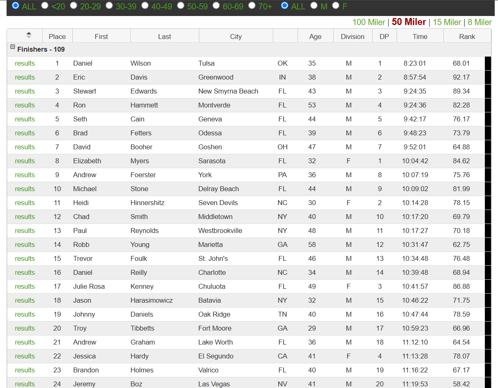

# 50-Mile Marathon Data Analysis and Visualization

## Objective:
The goal of this project is to demonstrate a complete end-to-end workflow, starting with web scraping, followed by data analysis in MySQL, and culminating in data visualization using Looker Studio. This project emphasizes the practical application of data extraction and visualization techniques to derive insights from web-based information.

**Website Used**:  
- Name: UltraSignup  
- URL: [https://ultrasignup.com/results_event.aspx?did=102259](https://ultrasignup.com/results_event.aspx?did=102259)  
- Purpose: Scraping race results data for analysis and visualization as part of an end-to-end data project.

## How I Did It:
### 1. Web Scraping:
- Used Selenium to scrape data from a dynamic webpage where traditional HTML parsing techniques would fail.
- Identified the structure of the target table and extracted relevant information into a structured format and Saved the data locally.

### 2. Data Analysis:
- Imported the scraped data into a MySQL database for and performing analysis.
- Utilized SQL queries to explore patterns within the dataset.

### 3. Visualization:
- Used Looker Studio to create compelling and interactive visualizations.
- Designed dashboards to provide actionable insights derived from the dataset.

## Outcome:
This project effectively demonstrates my ability to manage and analyze data at all stages, from raw extraction to actionable insights.

**This is a snippet of the data for scraping.**

**Looker Dashboard**

